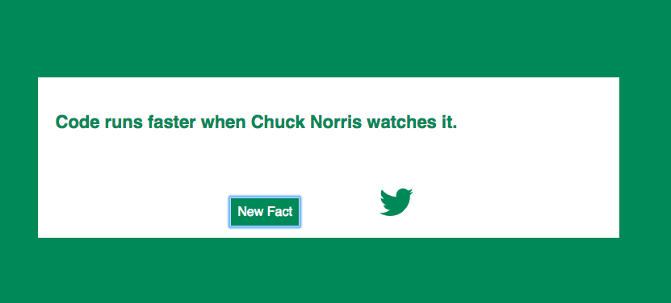

# random-quotes
Random Chuck Norris Joke Generator

Yeah ok so I'm a fan of Chuck Norris jokes. So sue me! I couldn't resiste using the [icndb's](http://www.icndb.com/api/) api for this freecodecamp project.

This was definitely one of my first jQuery projects so the looks might not be great, but the app functions like a champ and doesn't break so it's all good!

Anyway, I initially had this idea about generating random colors for the hex codes every time a new joke is pulled in from the API request. But once I got that working, I realized how much I hated the colors that were being generated so I found a pretty awesome idea about just randomly choosing from a an array of hex codes and now the colors look much better! 

    var randomColors = ['#555', '#4286f4', '#248257', '#3d2482', '#825924'];
    var randoms = function(){
      return randomColors[Math.floor(Math.random()*randomColors.length)]
    }
    
    
    
    
